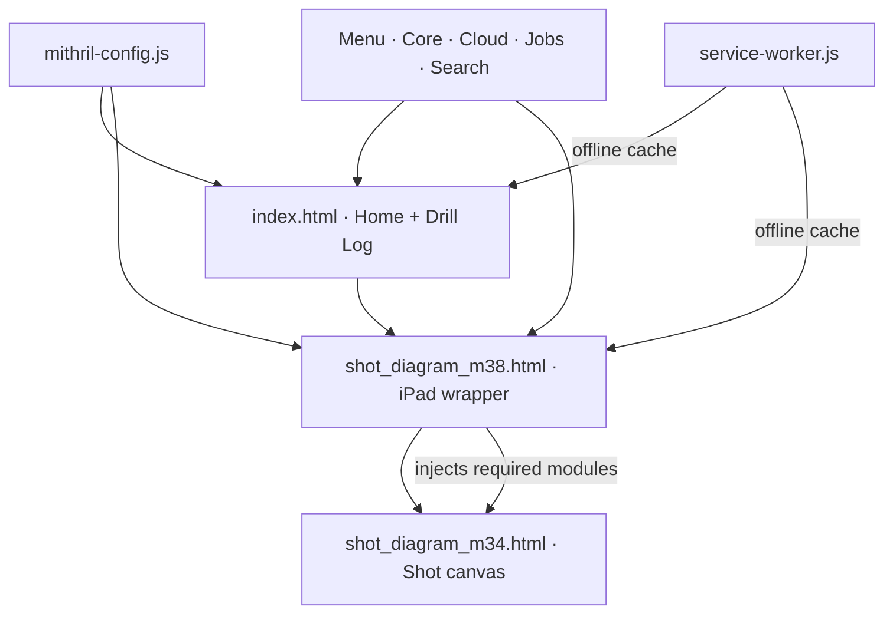

# MITHRIL Mobile

MITHRIL Mobile is an offline-capable field application for drill logs, shot diagrams, loading, timing, QA, and operational document sharing.

**MITHRIL** stands for **Modular Integrated Timing & Hole-pattern Reporting, Inventory & Logistics**.

- Live application: <https://zscurtis.github.io/mithril_mobile/>
- Hosting: GitHub Pages
- Runtime: static HTML, CSS, and JavaScript
- Cloud services: Firebase Authentication and Firestore
- Primary field targets: iPad, phone, and desktop browsers

## Current release

The published release is defined in two places:

- `mithril-config.js` is the version used by the application and service worker.
- `version.json` is the update metadata fetched by installed devices.

Current release: **m40.9.6.9.11 — Repository Cleanup**

## Repository map

| Path | Responsibility |
| --- | --- |
| `index.html` | Landing page and Drill Log application |
| `shot_diagram_m38.html` | Shot Diagram viewport wrapper; preserves iPad sizing, rotation, and touch compatibility |
| `shot_diagram_m34.html` | Shot Diagram canvas and original diagram engine, loaded inside the wrapper |
| `mithril-config.js` | Shared release version, label, and offline cache name |
| `mithril-menu.js` | Menus, themes, field-entry tools, summaries, timing tools, and newer UI behavior |
| `mithril-core.js` | Document model, access control, authentication bridge, cloud adapter, drill-to-shot conversion, QA, and shared operational logic |
| `mithril-cloud.js` | Trinity shared-cloud document operations and cloud permissions |
| `mithril-jobs.js` | Standardized job records, aliases, and job selection |
| `mithril-search.js` | Cloud-document search and filtering |
| `mithril-update.js` | Update checks, update dialog, cache clearing, and reload workflow |
| `service-worker.js` | Offline app-shell caching and network fallback only |
| `version.json` | Published update metadata and release notes |
| `manifest.webmanifest` | Installable web-app metadata |
| `icons/` | Application icons |
| `theme_assets/` | Active canvas background themes |

## Application flow

The Shot Diagram wrapper is intentional. It isolates the older canvas engine while handling Safari/iPad viewport changes, screen rotation, safe-area spacing, and legacy touch behavior. It should not be removed without device regression testing.

## Startup order

Both production entry pages load scripts in this order:

1. `mithril-config.js`
2. `mithril-update.js`
3. `mithril-menu.js`
4. `mithril-core.js`
5. `mithril-cloud.js`
6. `mithril-jobs.js`
7. `mithril-search.js`

The wrapper then loads the Shot Diagram canvas and injects only the modules required inside the iframe.

## Data model and storage

MITHRIL is local-first:

- Active Drill Log and Shot Diagram data are saved in browser storage.
- JSON backups preserve portable document data.
- CSV and PDF exports are generated in the browser.
- Firebase Authentication identifies users.
- Firestore stores shared company documents, user profiles, standardized jobs, and revisions.
- The service worker caches application code and visual assets, not operational documents.

Internal identifiers such as `m395`, `m400`, or `m40969` remain in some DOM IDs and browser-storage keys. They are retained for backward compatibility with documents and devices created by earlier releases. They are no longer used as production filenames.

## Access roles

| Role | Drill Log | Shot Diagram | Shared cloud write | Delete shared records | User administration |
| --- | ---: | ---: | ---: | ---: | ---: |
| Administrator | Yes | Yes | Yes | Yes | Yes |
| Blaster | Yes | Yes | Yes | No | No |
| Driller | Yes | No | Own Drill Logs | No | No |
| Driver | No | Yes | Own Shot Diagrams | No | No |
| Viewer | Read-only | Read-only | No | No | No |
| Pending | No | No | No | No | No |

Firestore security rules remain the final authority for cloud access. Client-side controls provide the matching interface behavior but must not be treated as the only security boundary.

## Offline behavior

The service worker:

- precaches all production HTML, JavaScript, icons, and theme assets;
- uses network-first handling for page navigation;
- falls back to cached pages when offline;
- serves static assets from cache first;
- always checks `version.json` through the network;
- removes only older `mithril-mobile-*` caches after a new worker activates.

It does **not** rewrite HTML, permissions, filenames, version numbers, or scripts at runtime.

## Publishing a release

1. Update `version`, `releaseLabel`, and `cacheName` in `mithril-config.js`.
2. Update the release metadata and notes in `version.json`.
3. Verify that the file paths in `service-worker.js` match the repository.
4. Run `node tests/release-check.mjs` for syntax, dependency, offline-cache, permissions, and timing regression checks.
5. Upload all changed files to the repository in one commit.
6. Wait for GitHub Pages to finish publishing.
7. Use **Check for Updates** or force-update each test device.
8. Confirm Home, Drill Log, Shot Diagram, cloud access, timing, exports, and offline reopen.

## Rollback

Every deleted legacy file and previous release remains available in Git history.

To roll back:

1. Open the repository commit history.
2. restore the last known-good commit or re-upload its files;
3. publish the rollback as a new commit;
4. force-update test devices so the earlier app shell replaces the current cache.

## Repository safety

This repository contains application code only. Do not commit completed shot files, customer records, private operational data, passwords, or service-account credentials.

The Firebase web configuration used by a browser application is not a substitute for security. Authentication, Firestore rules, role validation, and authorized-domain settings must remain correctly configured.
